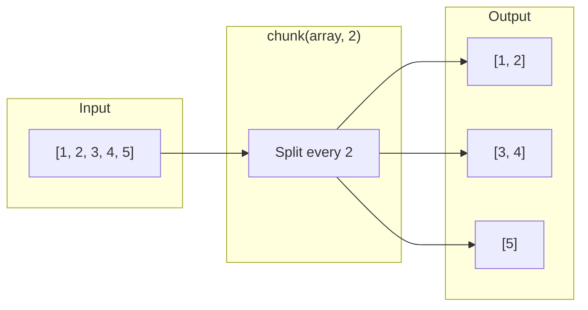

```mermaid
flowchart LR
    subgraph Input
        A["[1, 2, 3, 4, 5]"]
    end
    
    subgraph "chunk(array, 2)"
        B["Split every 2"]
    end
    
    subgraph Output
        C["[1, 2]"]
        D["[3, 4]"]
        E["[5]"]
    end
    
    A --> B
    B --> C
    B --> D
    B --> E
```
