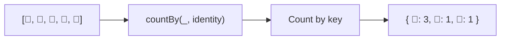
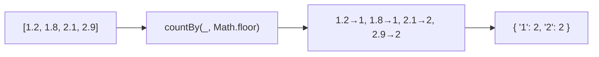

Groups elements by a computed key and counts occurrences instead of collecting elements.

```mermaid
flowchart LR
    A["[🍎, 🍊, 🍎, 🍋, 🍎]"] --> B["countBy(_, identity)"]
    B --> C["Count by key"]
    C --> D["{ 🍎: 3, 🍊: 1, 🍋: 1 }"]
```

### With iteratee function

```mermaid
flowchart LR
    A["[1.2, 1.8, 2.1, 2.9]"] --> B["countBy(_, Math.floor)"]
    B --> C["1.2→1, 1.8→1, 2.1→2, 2.9→2"]
    C --> D["{ '1': 2, '2': 2 }"]
```
