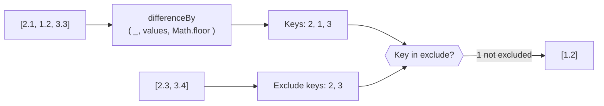

Compares elements by a computed key (iteratee) instead of direct equality.

```mermaid
flowchart LR
    A["[2.1, 1.2, 3.3]"] --> B["differenceBy
    ( _, values, Math.floor )"]
    B --> C["Keys: 2, 1, 3"]
    D["[2.3, 3.4]"] --> E["Exclude keys: 2, 3"]
    C --> F{{"Key in exclude?"}}
    E --> F
    F -->|"1 not excluded"| G["[1.2]"]
```
