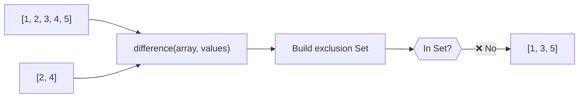

Returns elements from the first array that are not present in the exclusion array.
Uses a Set for O(1) lookups.

```mermaid
flowchart LR
    A["[1, 2, 3, 4, 5]"] --> C["difference(array, values)"]
    B["[2, 4]"] --> C
    C --> D["Build exclusion Set"]
    D --> E{{"In Set?"}}
    E -->|"❌ No"| F["[1, 3, 5]"]
```
