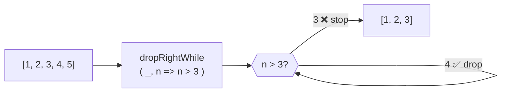

Drops elements from the end while the predicate returns true.
Scans from right to left.

```mermaid
flowchart LR
    A["[1, 2, 3, 4, 5]"] --> B["dropRightWhile
    ( _, n => n > 3 )"]
    B --> C{{"n > 3?"}}
    C -->|"5 ✅ drop"| C
    C -->|"4 ✅ drop"| C
    C -->|"3 ❌ stop"| D["[1, 2, 3]"]
```
