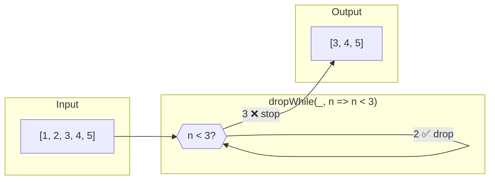

Drops elements from the beginning while the predicate returns true.
Stops at first falsy result.

```mermaid
flowchart LR
    subgraph Input
        A["[1, 2, 3, 4, 5]"]
    end
    
    subgraph "dropWhile(_, n => n < 3)"
        B{{"n < 3?"}}
    end
    
    subgraph Output
        C["[3, 4, 5]"]
    end
    
    A --> B
    B -->|"1 ✅ drop"| B
    B -->|"2 ✅ drop"| B
    B -->|"3 ❌ stop"| C
```
