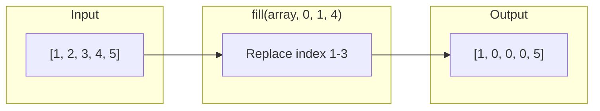
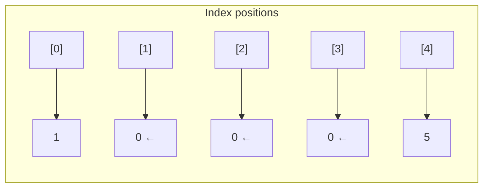

Replaces elements in a range with a specified value.
Unlike native `Array.fill()`, returns a new array (immutable).

```mermaid
flowchart LR
    subgraph Input
        A["[1, 2, 3, 4, 5]"]
    end
    
    subgraph "fill(array, 0, 1, 4)"
        B["Replace index 1-3"]
    end
    
    subgraph Output
        C["[1, 0, 0, 0, 5]"]
    end
    
    A --> B --> C
```

```mermaid
flowchart LR
    subgraph "Index positions"
        I0["[0]"] --> V1["1"]
        I1["[1]"] --> V0a["0 ←"]
        I2["[2]"] --> V0b["0 ←"]
        I3["[3]"] --> V0c["0 ←"]
        I4["[4]"] --> V5["5"]
    end
```
