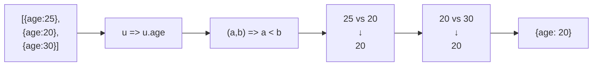

Generic extremum finder — finds the element that produces the best value according to a custom comparator.

### How comparator works

| Comparator | Finds | Example |
|------------|-------|---------|
| `(a, b) => a < b` | Minimum | Youngest user |
| `(a, b) => a > b` | Maximum | Oldest user |
