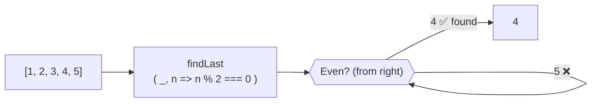

Returns the last element that matches the predicate.
Iterates from right to left.

```mermaid
flowchart LR
    A["[1, 2, 3, 4, 5]"] --> B["findLast
    ( _, n => n % 2 === 0 )"]
    B --> C{{"Even? (from right)"}}
    C -->|"5 ❌"| C
    C -->|"4 ✅ found"| D["4"]
```
