Groups elements into arrays by a computed key.
Unlike `countBy` which counts, `groupBy` collects the actual elements.

```mermaid
flowchart LR
    A["[🍎, 🍊, 🍎, 🍋, 🍎]"] --> B["groupBy(_, identity)"]
    B --> C["Group by key"]
    C --> D["{ 🍎: [🍎,🍎,🍎], 
        🍊: [🍊], 
        🍋: [🍋] }"]
```

### With iteratee function

### groupBy vs countBy

| Function | Returns | Use case |
|----------|---------|----------|
| `groupBy` | `{ key: T[] }` | Need the elements |
| `countBy` | `{ key: number }` | Only need counts |
