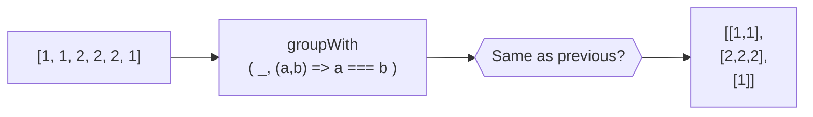
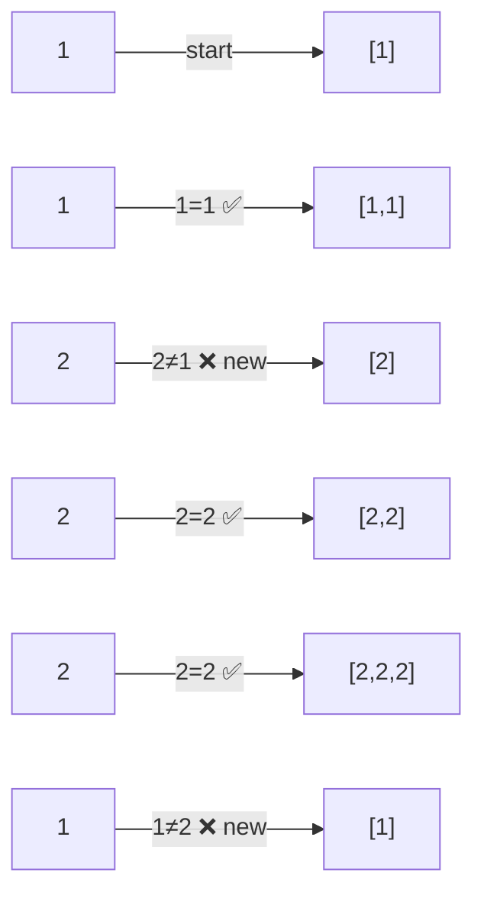

Groups consecutive elements using a comparator function.
Creates new group when comparator returns false.

```mermaid
flowchart LR
    A["[1, 1, 2, 2, 2, 1]"] --> B["groupWith
    ( _, (a,b) => a === b )"]
    B --> C{{"Same as previous?"}}
    C --> D["[[1,1], 
    [2,2,2], 
    [1]]"]
```

### Step-by-step

<!-- keep-horizontal -->

```mermaid
flowchart LR
    E1["1"] -->|"start"| G1["[1]"]
    E2["1"] -->|"1=1 ✅"| G1b["[1,1]"]
    E3["2"] -->|"2≠1 ❌ new"| G2["[2]"]
    E4["2"] -->|"2=2 ✅"| G2b["[2,2]"]
    E5["2"] -->|"2=2 ✅"| G2c["[2,2,2]"]
    E6["1"] -->|"1≠2 ❌ new"| G3["[1]"]
```
