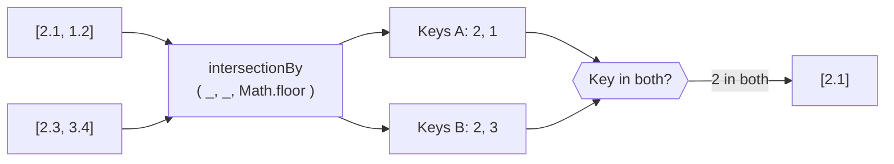

Compares elements by a computed key to find common values.

```mermaid
flowchart LR
    A["[2.1, 1.2]"] --> C["intersectionBy
    ( _, _, Math.floor )"]
    B["[2.3, 3.4]"] --> C
    C --> D["Keys A: 2, 1"]
    C --> E["Keys B: 2, 3"]
    D --> F{{"Key in both?"}}
    E --> F
    F -->|"2 in both"| G["[2.1]"]
```
