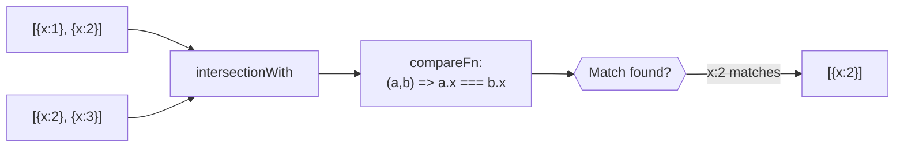

Compares elements using a custom comparator function.

```mermaid
flowchart LR
    A["[{x:1}, {x:2}]"] --> C["intersectionWith"]
    B["[{x:2}, {x:3}]"] --> C
    C --> D["compareFn:
    (a,b) => a.x === b.x"]
    D --> E{{"Match found?"}}
    E -->|"x:2 matches"| F["[{x:2}]"]
```
