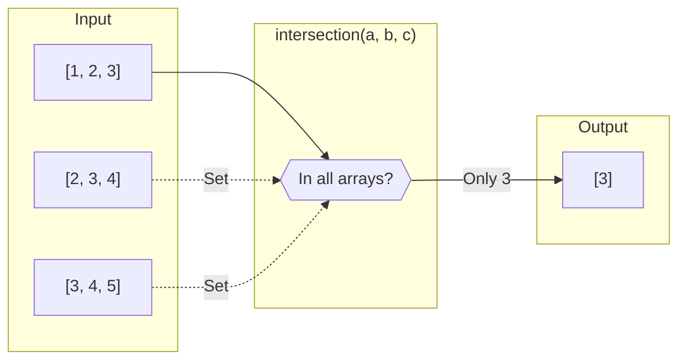

Returns elements that exist in ALL input arrays.
Uses Set for O(1) membership testing.

```mermaid
flowchart LR
    subgraph Input
        A["[1, 2, 3]"]
        B["[2, 3, 4]"]
        C["[3, 4, 5]"]
    end
    
    subgraph "intersection(a, b, c)"
        D{{"In all arrays?"}}
    end
    
    subgraph Output
        E["[3]"]
    end
    
    A --> D
    B -.->|"Set"| D
    C -.->|"Set"| D
    D -->|"Only 3"| E
```
