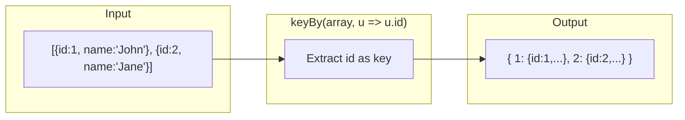
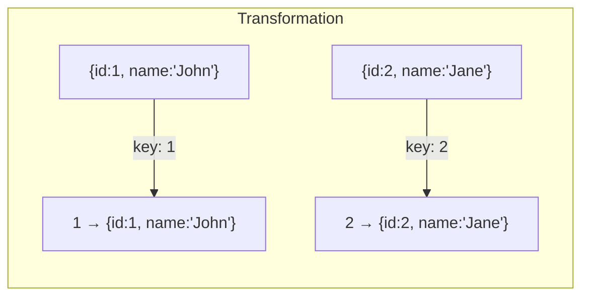

Creates an object where each element is stored under a computed key.
Last value wins for duplicate keys.

### keyBy vs groupBy

| Function | Duplicate keys | Returns |
|----------|----------------|---------|
| `keyBy` | Last wins | `{ key: T }` |
| `groupBy` | All kept | `{ key: T[] }` |
