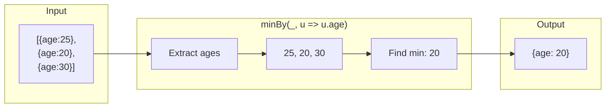

Finds the element with the minimum value computed by iteratee.

```mermaid
flowchart LR
    subgraph Input
        A["[{age:25},
         {age:20}, 
         {age:30}]"]
    end
    
    subgraph "minBy(_, u => u.age)"
        B["Extract ages"]
        C["25, 20, 30"]
        D["Find min: 20"]
    end
    
    subgraph Output
        E["{age: 20}"]
    end
    
    A --> B --> C --> D --> E
```
