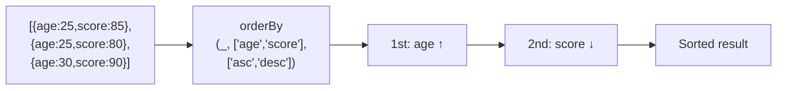

Sorts by multiple criteria with configurable sort orders (asc/desc).
Unlike native `sort()`, returns a new array (immutable).

```mermaid
flowchart LR
    A["[{age:25,score:85},
      {age:25,score:80},
      {age:30,score:90}]"]
    A --> B["orderBy
    (_, ['age','score'],
            ['asc','desc'])"]
    B --> C["1st: age ↑"]
    C --> D["2nd: score ↓"]
    D --> E["Sorted result"]
```

### Multi-criteria logic

```mermaid
flowchart LR
    S1["Compare age (asc)"]
    S1 -->|"25 = 25"| S2["Compare score (desc)"]
    S2 -->|"85 > 80"| R1["85 before 80"]
```
