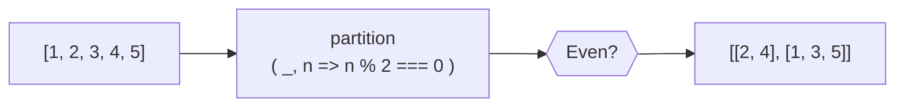
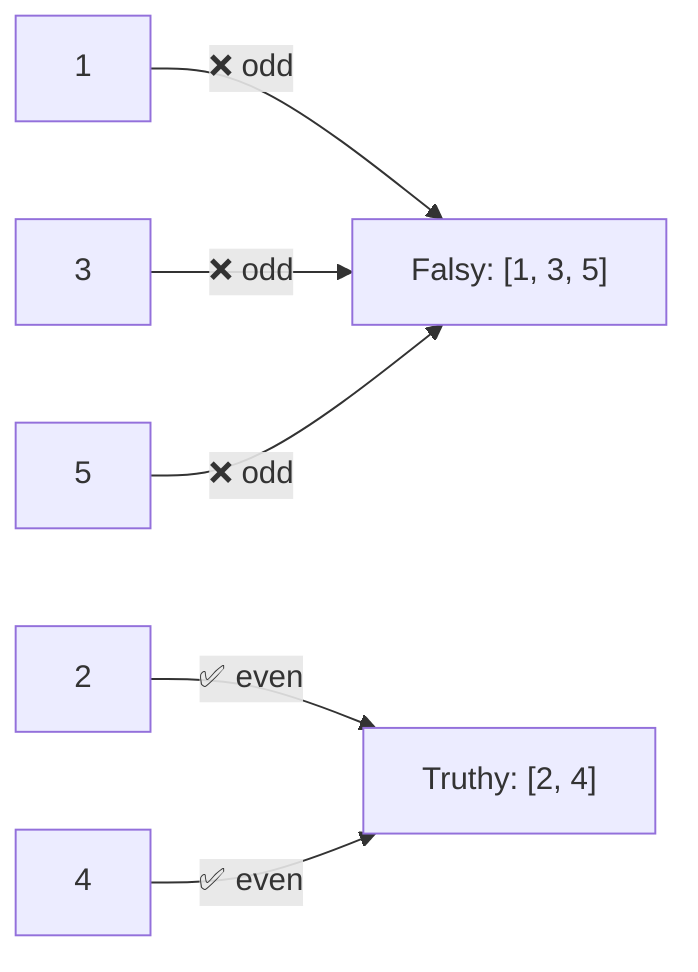

Splits an array into two groups: elements matching the predicate and elements that don't.
Single pass through the array.

### Element routing

### partition vs filter

| Function | Returns | Use case |
|----------|---------|----------|
| `filter` | Matching only | Don't need rejected |
| `partition` | [matching, rejected] | Need both groups |
