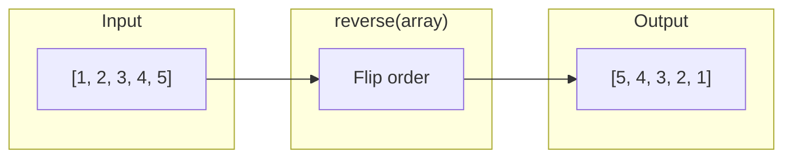
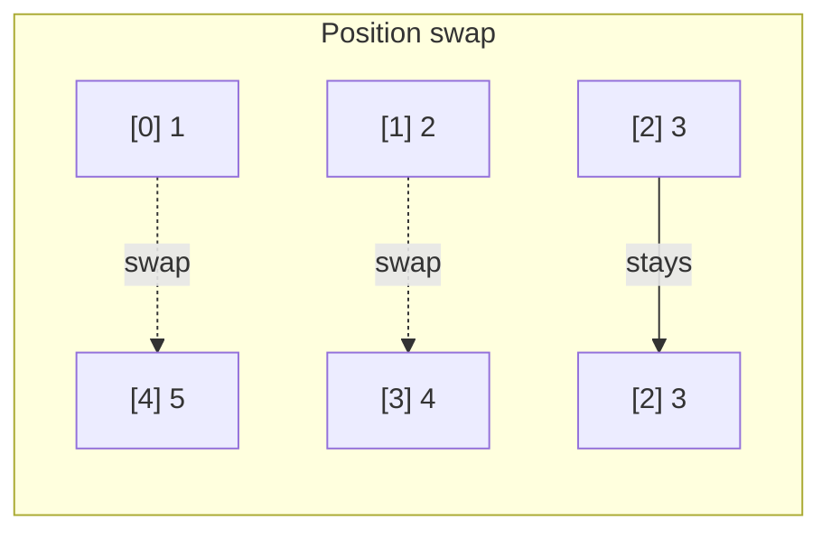

Reverses array order. Unlike native `Array.reverse()`, returns a new array (immutable).

```mermaid
flowchart LR
    subgraph Input
        A["[1, 2, 3, 4, 5]"]
    end
    
    subgraph "reverse(array)"
        B["Flip order"]
    end
    
    subgraph Output
        C["[5, 4, 3, 2, 1]"]
    end
    
    A --> B --> C
```

```mermaid
flowchart LR
    subgraph "Position swap"
        P0["[0] 1"] -.->|"swap"| P4["[4] 5"]
        P1["[1] 2"] -.->|"swap"| P3["[3] 4"]
        P2["[2] 3"] -->|"stays"| P2b["[2] 3"]
    end
```
