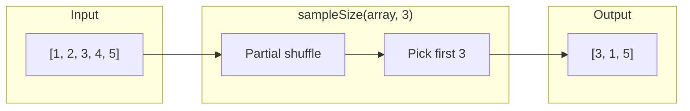
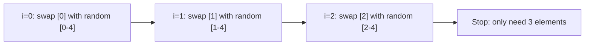

Returns `n` random elements using partial Fisher-Yates shuffle.

```mermaid
flowchart LR
    subgraph Input
        A["[1, 2, 3, 4, 5]"]
    end
    
    subgraph "sampleSize(array, 3)"
        B["Partial shuffle"]
        C["Pick first 3"]
    end
    
    subgraph Output
        D["[3, 1, 5]"]
    end
    
    A --> B --> C --> D
```

```mermaid
flowchart LR
    S1["i=0: swap [0] with random [0-4]"]
    S2["i=1: swap [1] with random [1-4]"]
    S3["i=2: swap [2] with random [2-4]"]
    S4["Stop: only need 3 elements"]
    
    S1 --> S2 --> S3 --> S4
```
