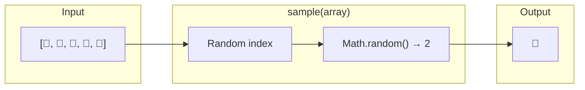

Returns a random element from an array.
O(1) operation — direct index access.

```mermaid
flowchart LR
    subgraph Input
        A["[🍎, 🍊, 🍋, 🍇, 🍓]"]
    end
    
    subgraph "sample(array)"
        B["Random index"]
        C["Math.random() → 2"]
    end
    
    subgraph Output
        D["🍋"]
    end
    
    A --> B --> C --> D
```
