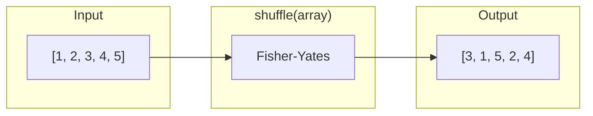
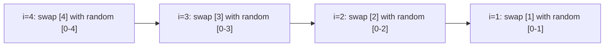

Randomly reorders array elements using Fisher-Yates algorithm.
Each permutation has equal probability.

```mermaid
flowchart LR
    subgraph Input
        A["[1, 2, 3, 4, 5]"]
    end
    
    subgraph "shuffle(array)"
        B["Fisher-Yates"]
    end
    
    subgraph Output
        C["[3, 1, 5, 2, 4]"]
    end
    
    A --> B --> C
```

```mermaid
flowchart LR
    S1["i=4: swap [4] with random [0-4]"]
    S2["i=3: swap [3] with random [0-3]"]
    S3["i=2: swap [2] with random [0-2]"]
    S4["i=1: swap [1] with random [0-1]"]
    
    S1 --> S2 --> S3 --> S4
```
