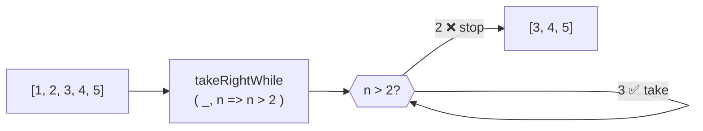

Takes elements from the end while predicate is true.
Scans from right to left.

```mermaid
flowchart LR
    A["[1, 2, 3, 4, 5]"] --> B["takeRightWhile
    ( _, n => n > 2 )"]
    B --> C{{"n > 2?"}}
    C -->|"5 ✅ take"| C
    C -->|"4 ✅ take"| C
    C -->|"3 ✅ take"| C
    C -->|"2 ❌ stop"| D["[3, 4, 5]"]
```
