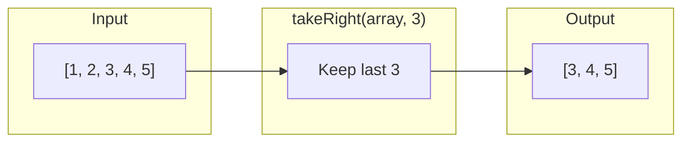

Takes elements from the end instead of the beginning.

```mermaid
flowchart LR
    subgraph Input
        A["[1, 2, 3, 4, 5]"]
    end
    
    subgraph "takeRight(array, 3)"
        B["Keep last 3"]
    end
    
    subgraph Output
        C["[3, 4, 5]"]
    end
    
    A --> B --> C
```
