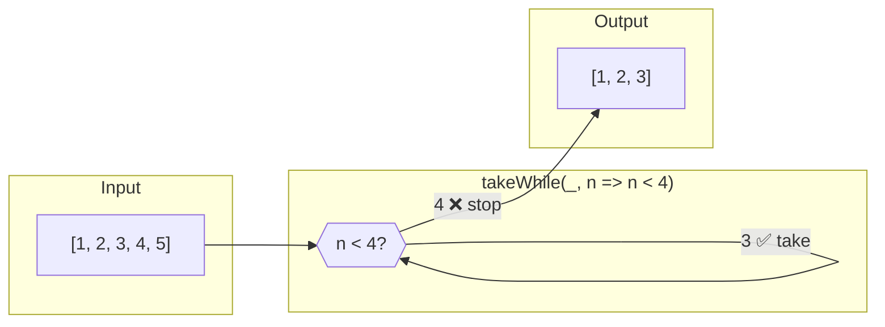

Takes elements from the beginning while predicate is true.
Stops at first falsy result.

```mermaid
flowchart LR
    subgraph Input
        A["[1, 2, 3, 4, 5]"]
    end
    
    subgraph "takeWhile(_, n => n < 4)"
        B{{"n < 4?"}}
    end
    
    subgraph Output
        C["[1, 2, 3]"]
    end
    
    A --> B
    B -->|"1 ✅ take"| B
    B -->|"2 ✅ take"| B
    B -->|"3 ✅ take"| B
    B -->|"4 ❌ stop"| C
```
