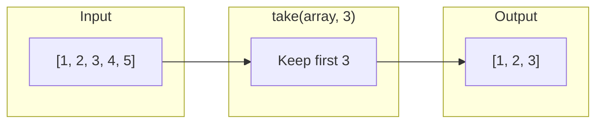

```mermaid
flowchart LR
    subgraph Input
        A["[1, 2, 3, 4, 5]"]
    end
    
    subgraph "take(array, 3)"
        B["Keep first 3"]
    end
    
    subgraph Output
        C["[1, 2, 3]"]
    end
    
    A --> B --> C
```
