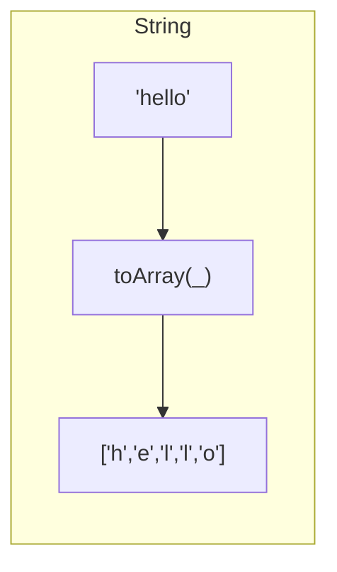
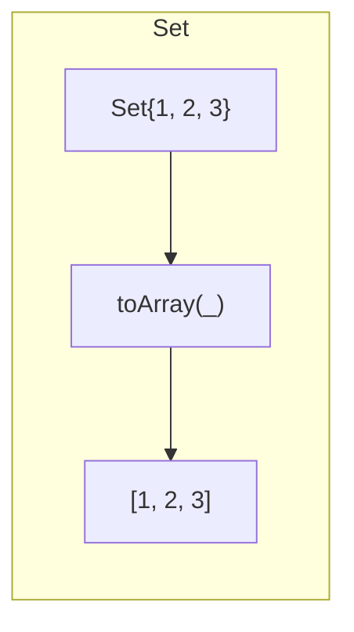
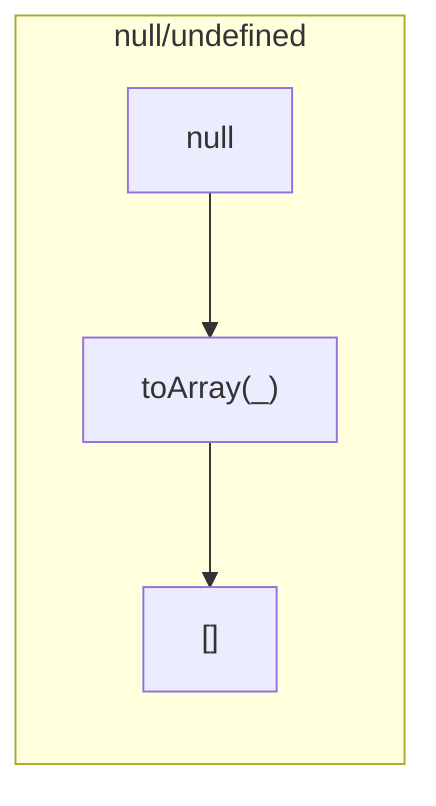

Converts various values to arrays.
Handles strings, iterables, and array-likes.

```mermaid
flowchart LR
    subgraph String
    A1["'hello'"] --> B1["toArray(_)"] --> C1["['h','e','l','l','o']"]
    end
```

```mermaid
flowchart LR
    subgraph Set
    A2["Set{1, 2, 3}"] --> B2["toArray(_)"] --> C2["[1, 2, 3]"]
    end
```

```mermaid
flowchart LR
    subgraph null/undefined
    A3["null"] --> B3["toArray(_)"] --> C3["[]"]
    end
```