Toggle adds an element if absent, or removes it if present — a single operation for both actions.
Uses reference equality (`===`) to find the element.

```mermaid
flowchart LR
    subgraph Input
        A["[🍎, 🍊, 🍋]"]
    end
    
    subgraph "toggle(array, 🍊)"
        B{{"🍊 exists?"}}
    end
    
    subgraph Output
        C["[🍎, 🍋]"]
    end
    
    A --> B
    B -->|"Yes → remove"| C
```

```mermaid
flowchart LR
    subgraph Input
        D["[🍎, 🍊, 🍋]"]
    end
    
    subgraph "toggle(array, 🍇)"
        E{{"🍇 exists?"}}
    end
    
    subgraph Output
        F["[🍎, 🍊, 🍋, 🍇]"]
    end
    
    D --> E
    E -->|"No → append"| F
```

### Toggle vs Filter vs Spread

| Operation | Purpose | Result |
|-----------|---------|--------|
| `toggle(arr, x)` | Add or remove in one call | Toggles presence |
| `arr.filter(i => i !== x)` | Remove only | Always removes |
| `[...arr, x]` | Add only | Always appends (duplicates possible) |