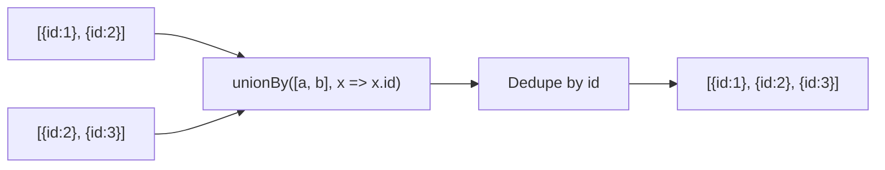

Deduplicates by a computed key instead of direct equality.

```mermaid
flowchart LR
    A["[{id:1}, {id:2}]"] --> C["unionBy([a, b], x => x.id)"]
    B["[{id:2}, {id:3}]"] --> C
    C --> D["Dedupe by id"]
    D --> E["[{id:1}, {id:2}, {id:3}]"]
```
