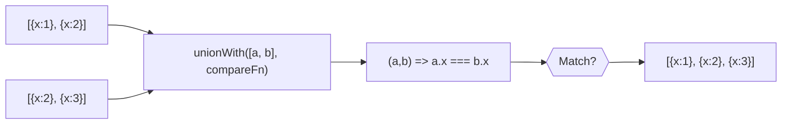

Deduplicates using a custom comparator function.

```mermaid
flowchart LR
    A["[{x:1}, {x:2}]"] --> C["unionWith([a, b], compareFn)"]
    B["[{x:2}, {x:3}]"] --> C
    C --> D["(a,b) => a.x === b.x"]
    D --> E{{"Match?"}}
    E --> F["[{x:1}, {x:2}, {x:3}]"]
```
