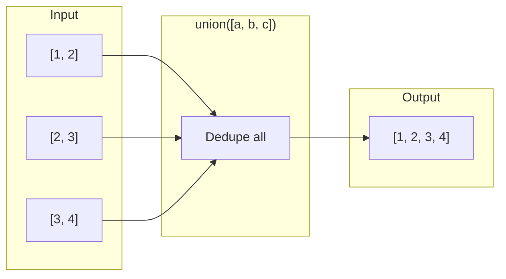

Combines multiple arrays into one with unique values.
First occurrence wins — preserves order of first appearance.

```mermaid
flowchart LR
    subgraph Input
        A["[1, 2]"]
        B["[2, 3]"]
        C["[3, 4]"]
    end
    
    subgraph "union([a, b, c])"
        D["Dedupe all"]
    end
    
    subgraph Output
        E["[1, 2, 3, 4]"]
    end
    
    A --> D
    B --> D
    C --> D
    D --> E
```
