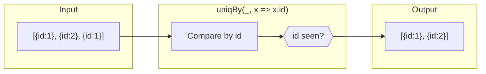

Removes duplicates by comparing computed keys.
First occurrence wins.

```mermaid
flowchart LR
    subgraph Input
        A["[{id:1}, {id:2}, {id:1}]"]
    end
    
    subgraph "uniqBy(_, x => x.id)"
        B["Compare by id"]
        C{{"id seen?"}}
    end
    
    subgraph Output
        D["[{id:1}, {id:2}]"]
    end
    
    A --> B --> C --> D
```
