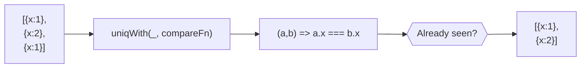

Removes duplicates using a custom comparator function.
First occurrence wins.

```mermaid
flowchart LR
    A["[{x:1},
    {x:2},
    {x:1}]"] --> B["uniqWith(_, compareFn)"]
    B --> C["(a,b) => a.x === b.x"]
    C --> D{{"Already seen?"}}
    D --> E["[{x:1},
    {x:2}]"]
```
