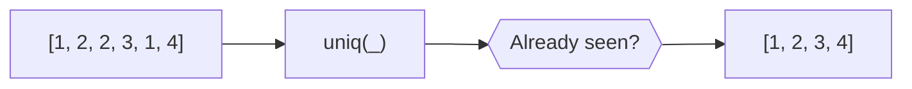

Removes duplicates using strict equality (===).
First occurrence wins.

```mermaid
flowchart LR
    A["[1, 2, 2, 3, 1, 4]"] --> B["uniq(_)"]
    B --> C{{"Already seen?"}}
    C --> D["[1, 2, 3, 4]"]
```
