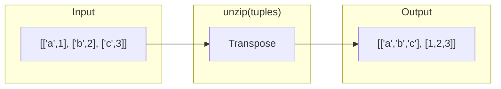
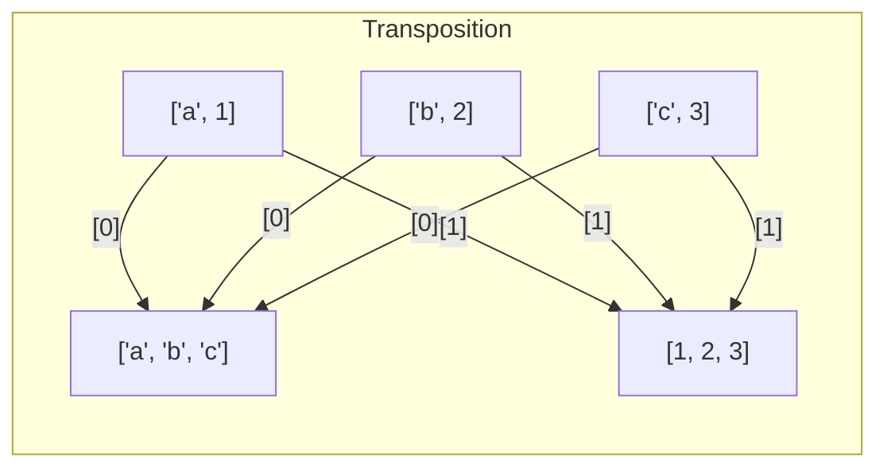
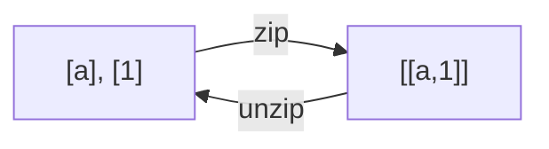

Transposes an array of tuples — the inverse of `zip`.
Separates combined tuples back into their constituent arrays.

```mermaid
flowchart LR
    subgraph Input
        A["[['a',1], ['b',2], ['c',3]]"]
    end
    
    subgraph "unzip(tuples)"
        B["Transpose"]
    end
    
    subgraph Output
        C["[['a','b','c'], [1,2,3]]"]
    end
    
    A --> B --> C
```

```mermaid
flowchart LR
    subgraph "Transposition"
        T1["['a', 1]"]
        T2["['b', 2]"]
        T3["['c', 3]"]
        
        R1["['a', 'b', 'c']"]
        R2["[1, 2, 3]"]
        
        T1 -->|"[0]"| R1
        T2 -->|"[0]"| R1
        T3 -->|"[0]"| R1
        
        T1 -->|"[1]"| R2
        T2 -->|"[1]"| R2
        T3 -->|"[1]"| R2
    end
```

### zip ↔ unzip

```mermaid
flowchart LR
    A["[a], [1]"] -->|"zip"| B["[[a,1]]"]
    B -->|"unzip"| A
```
