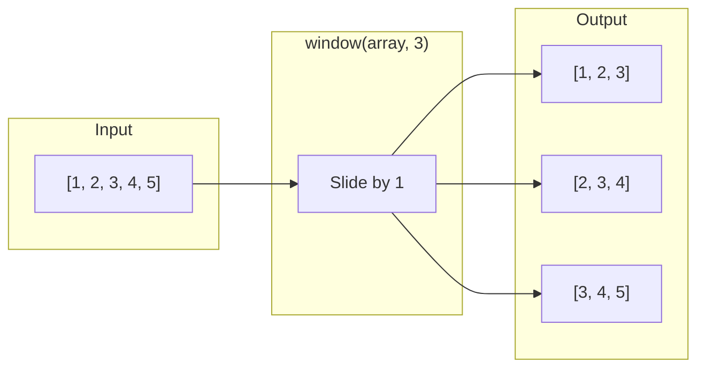
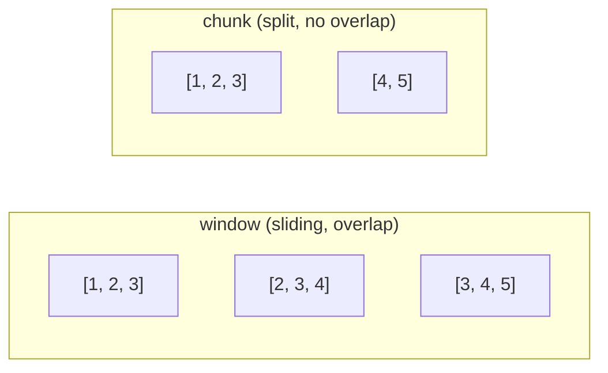

Window creates overlapping subarrays by sliding one element at a time.
Unlike `chunk` which splits without overlap, `window` preserves continuity between groups.

### Window vs Chunk

| Operation | Overlap | Output for `[1,2,3,4,5]` size 3 |
|-----------|---------|--------------------------------|
| `window(arr, 3)` | Yes | `[[1,2,3], [2,3,4], [3,4,5]]` |
| `chunk(arr, 3)` | No | `[[1,2,3], [4,5]]` |
