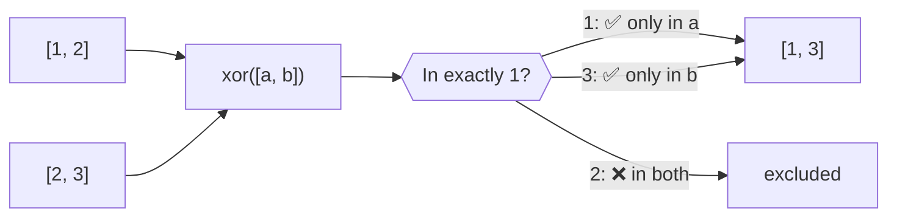
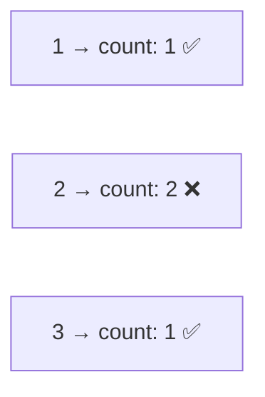

Symmetric difference — returns values that appear in exactly one array.
Values present in multiple arrays are excluded.

### Count occurrences

### xor vs difference vs intersection

| Function | Returns |
|----------|---------|
| `difference(a, b)` | In A but not B |
| `intersection(a, b)` | In both A and B |
| `xor([a, b])` | In A or B, but not both |
