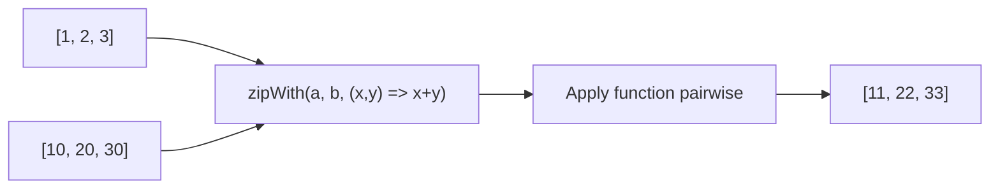
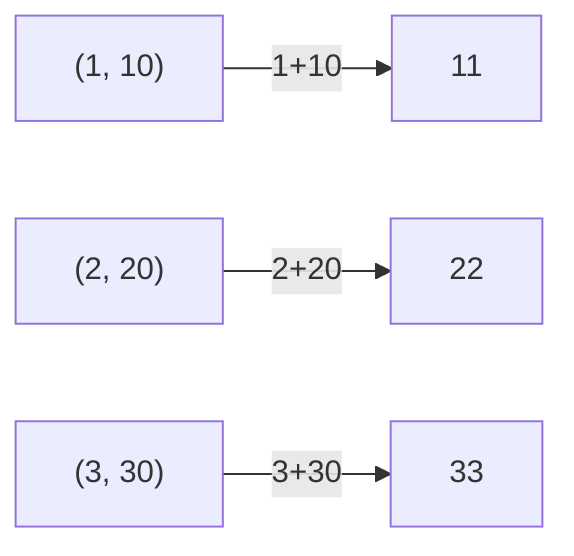

Combines arrays with a custom function instead of creating tuples.

```mermaid
flowchart LR
    A["[1, 2, 3]"] --> C["zipWith(a, b, (x,y) => x+y)"]
    B["[10, 20, 30]"] --> C
    C --> D["Apply function pairwise"]
    D --> E["[11, 22, 33]"]
```

### Element-wise operation

```mermaid
flowchart LR
    P1["(1, 10)"] -->|"1+10"| R1["11"]
    P2["(2, 20)"] -->|"2+20"| R2["22"]
    P3["(3, 30)"] -->|"3+30"| R3["33"]
```
