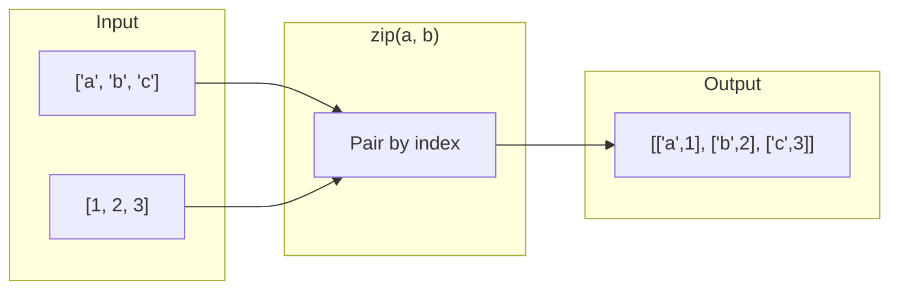
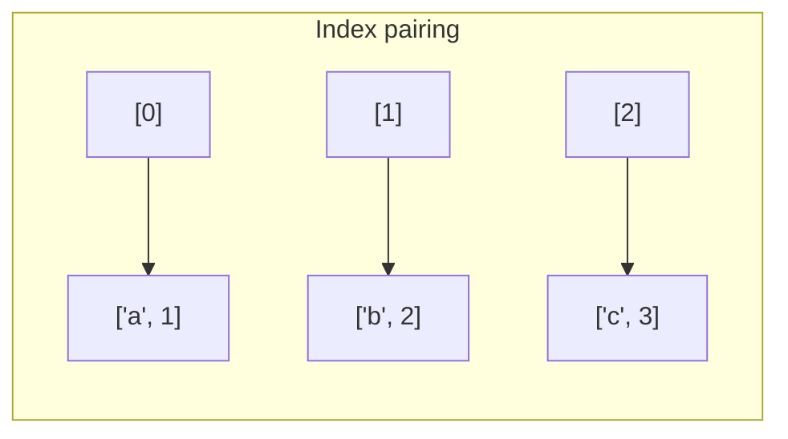

Combines multiple arrays into an array of tuples, pairing elements by index.
Result length is determined by the shortest array.

```mermaid
flowchart LR
    subgraph Input
        A["['a', 'b', 'c']"]
        B["[1, 2, 3]"]
    end
    
    subgraph "zip(a, b)"
        C["Pair by index"]
    end
    
    subgraph Output
        D["[['a',1], ['b',2], ['c',3]]"]
    end
    
    A --> C
    B --> C
    C --> D
```

```mermaid
flowchart LR
    subgraph "Index pairing"
        I0["[0]"] --> T0["['a', 1]"]
        I1["[1]"] --> T1["['b', 2]"]
        I2["[2]"] --> T2["['c', 3]"]
    end
```
