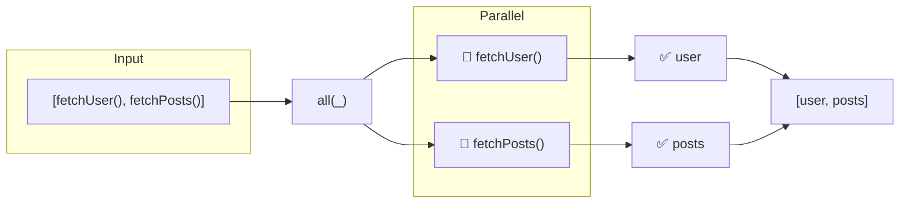
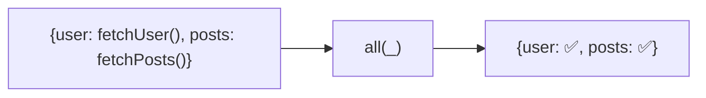

Executes multiple promises concurrently and collects their results.
Supports both array and object inputs — object input returns named results.

```mermaid
flowchart LR
    subgraph Input
        A["[fetchUser(), fetchPosts()]"]
    end
    A --> B["all(_)"]
    subgraph Parallel
        C["🔄 fetchUser()"]
        D["🔄 fetchPosts()"]
    end
    B --> C
    B --> D
    C --> E["✅ user"]
    D --> F["✅ posts"]
    E --> G["[user, posts]"]
    F --> G
```

### Object Input (Named Results)

```mermaid
flowchart LR
    A["{user: fetchUser(), posts: fetchPosts()}"] --> B["all(_)"]
    B --> C["{user: ✅, posts: ✅}"]
```
