Prevents duplicate concurrent executions for the same key.
Multiple calls with identical keys share a single execution — the key is released on completion.

```mermaid
sequenceDiagram
    participant C1 as Caller 1
    participant C2 as Caller 2
    participant D as dedupeByKey
    participant F as fetchUser()
    
    C1->>D: dedupeByKey('user-123', fn)
    Note right of D: 🔑 key registered
    D->>F: execute
    C2->>D: dedupeByKey('user-123', fn)
    Note right of D: 🔗 shares existing promise
    F-->>D: ✅ result
    D-->>C1: result
    D-->>C2: result (same)
    Note right of D: 🗑️ key released
```

### Different Keys Execute Independently

```mermaid
flowchart LR
    A["dedupeByKey('A', fn)"] --> B["🔄 fetchUser('A')"]
    C["dedupeByKey('B', fn)"] --> D["🔄 fetchUser('B')"]
    B --> E["✅ userA"]
    D --> F["✅ userB"]
```

