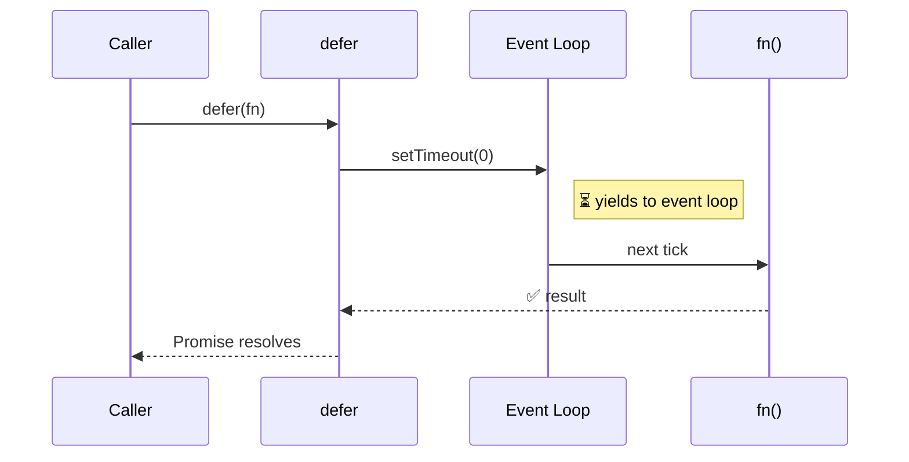
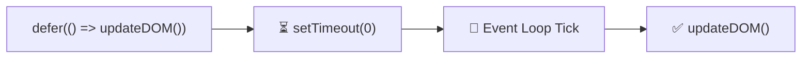

Defers function execution to the next tick of the event loop.
Uses `setTimeout(0)` to yield control back to the browser/runtime before executing.

```mermaid
sequenceDiagram
    participant C as Caller
    participant D as defer
    participant E as Event Loop
    participant F as fn()
    
    C->>D: defer(fn)
    D->>E: setTimeout(0)
    Note right of E: ⏳ yields to event loop
    E->>F: next tick
    F-->>D: ✅ result
    D-->>C: Promise resolves
```

### Practical Flow

```mermaid
flowchart LR
    A["defer(() => updateDOM())"] --> B["⏳ setTimeout(0)"]
    B --> C["🔄 Event Loop Tick"]
    C --> D["✅ updateDOM()"]
```
