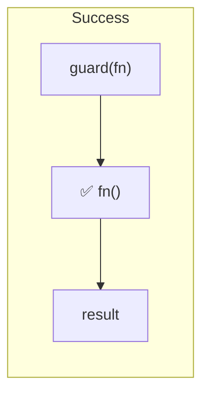
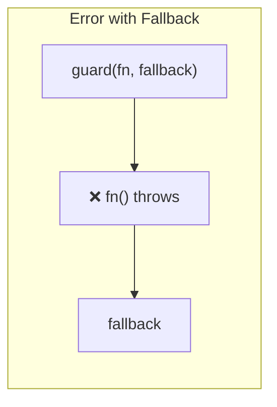
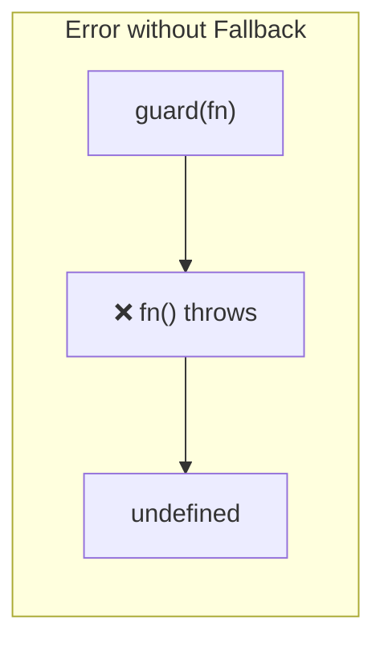
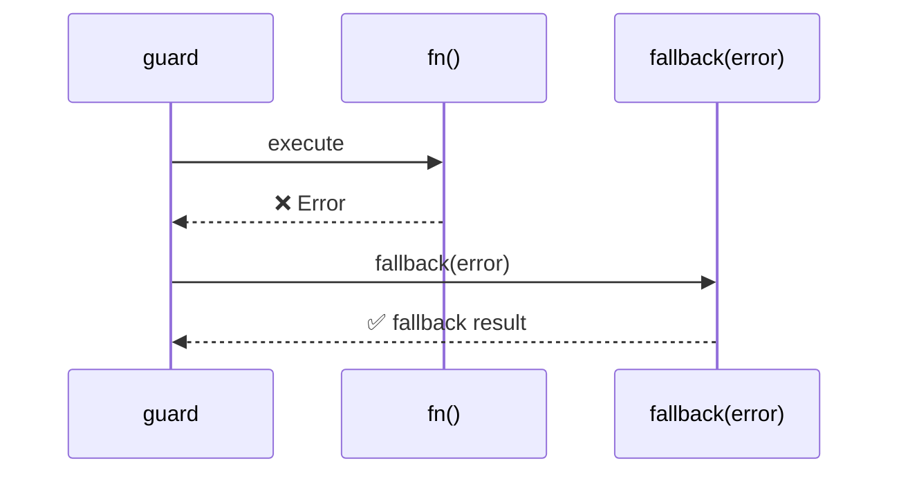

Wraps an async function with error handling and optional fallback.
On success, returns the result. On error, returns the fallback value (or `undefined` if none provided).

### Fallback Function

The fallback can be a function that receives the error:

