Executes async functions in parallel with concurrency control.
Limits how many functions run simultaneously — results preserve original order.

```mermaid
sequenceDiagram
    participant P as parallel(fns, 2)
    participant W1 as Worker 1
    participant W2 as Worker 2
    
    Note over P: concurrency = 2
    P->>W1: fn[0]
    P->>W2: fn[1]
    W1-->>P: ✅ result[0]
    P->>W1: fn[2]
    W2-->>P: ✅ result[1]
    W1-->>P: ✅ result[2]
    Note over P: [result[0], result[1], result[2]]
```

### Concurrency Visualization

```mermaid
flowchart LR
    A["4 tasks, concurrency=2"] --> B["Batch 1"]
    B --> T1["⏱️ Task 1 ✅"]
    B --> T2["⏱️ Task 2 ✅"]
    T1 --> B2["Batch 2"]
    T2 --> B2
    B2 --> T3["⏱️ Task 3 ✅"]
    B2 --> T4["⏱️ Task 4 ✅"]
```

### Fail-Fast Behavior

On first error, remaining operations are aborted:

```mermaid
flowchart LR
    A["parallel(fns, 2)"] --> B["🔄 fn[0]"]
    A --> C["❌ fn[1] throws"]
    C --> D["⛔ abort remaining"]
    D --> E["rejects"]
```

