Ensures sequential execution for functions sharing the same key.
Different keys run in parallel — same key waits for previous to complete.

```mermaid
sequenceDiagram
    participant C1 as Call 1
    participant C2 as Call 2
    participant Q as queueByKey
    participant F as fn()
    
    C1->>Q: queueByKey('user-123', fn1)
    Note right of Q: 🔑 queue created
    Q->>F: execute fn1
    C2->>Q: queueByKey('user-123', fn2)
    Note right of Q: ⏳ fn2 queued
    F-->>Q: ✅ fn1 complete
    Q->>F: execute fn2
    F-->>Q: ✅ fn2 complete
    Q-->>C1: result1
    Q-->>C2: result2
```

### Queue vs Dedupe

| | queueByKey | dedupeByKey |
|--|------------|-------------|
| **Same key calls** | Sequential | Shared |
| **Result** | Each gets own | Same promise |
| **Use case** | Ordered writes | Duplicate reads |

```mermaid
flowchart LR
    subgraph "queueByKey (sequential)"
        A1["call 1"] --> B1["🔄 exec"]
        B1 --> C1["call 2"]
        C1 --> D1["🔄 exec"]
    end
```

```mermaid
flowchart LR
    subgraph "dedupeByKey (shared)"
        A2["call 1"] --> B2["🔄 exec"]
        C2["call 2"] --> B2
        B2 --> D2["✅ same result"]
    end
```

