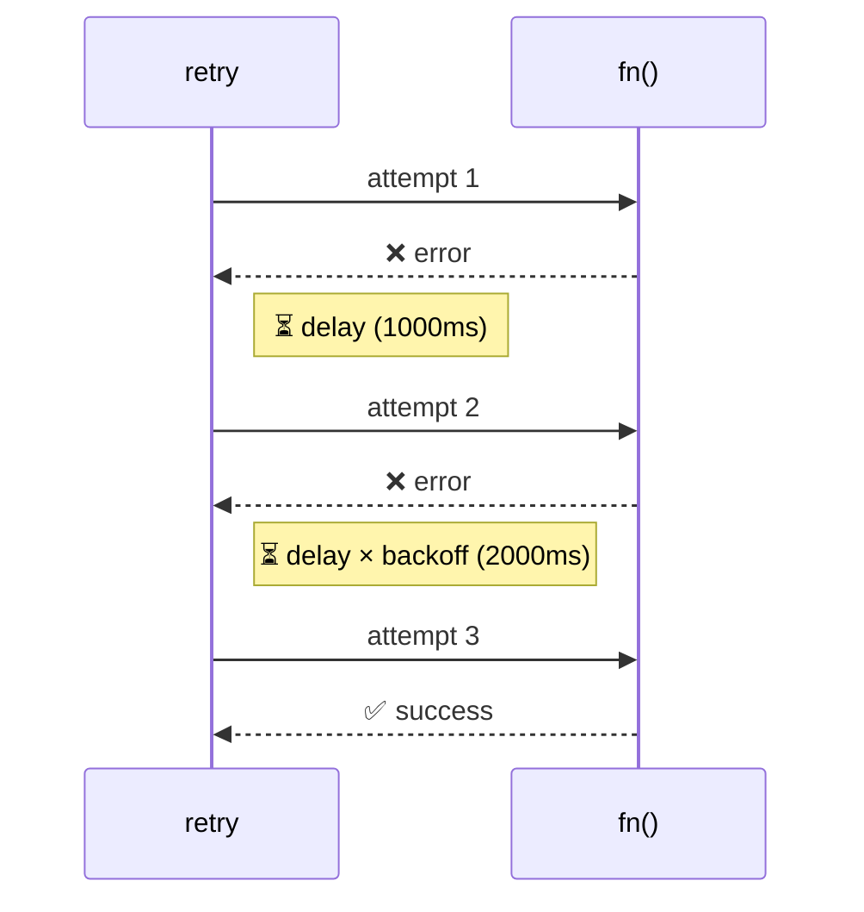
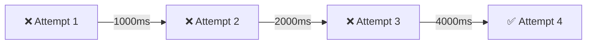
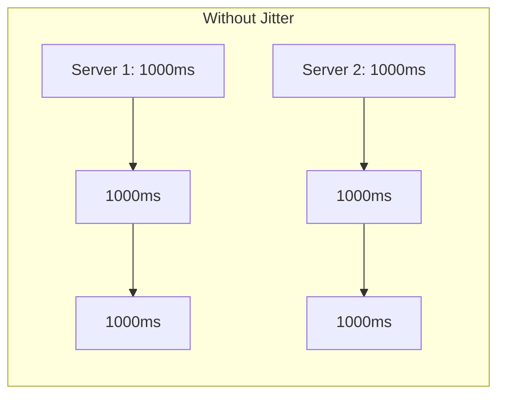
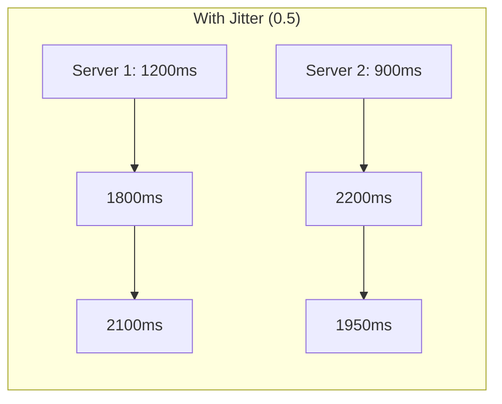
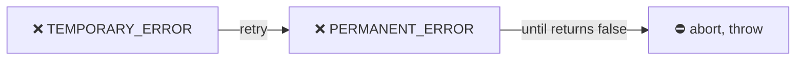

Retries a failed async function with configurable backoff and jitter.
Exponential backoff increases delay between attempts — jitter adds randomness to prevent thundering herd.

### Exponential Backoff

### Jitter Visualization

Jitter adds randomness to delay to avoid synchronized retries:

### Until (Error Filter)

The `until` option aborts retry if error is permanent:

