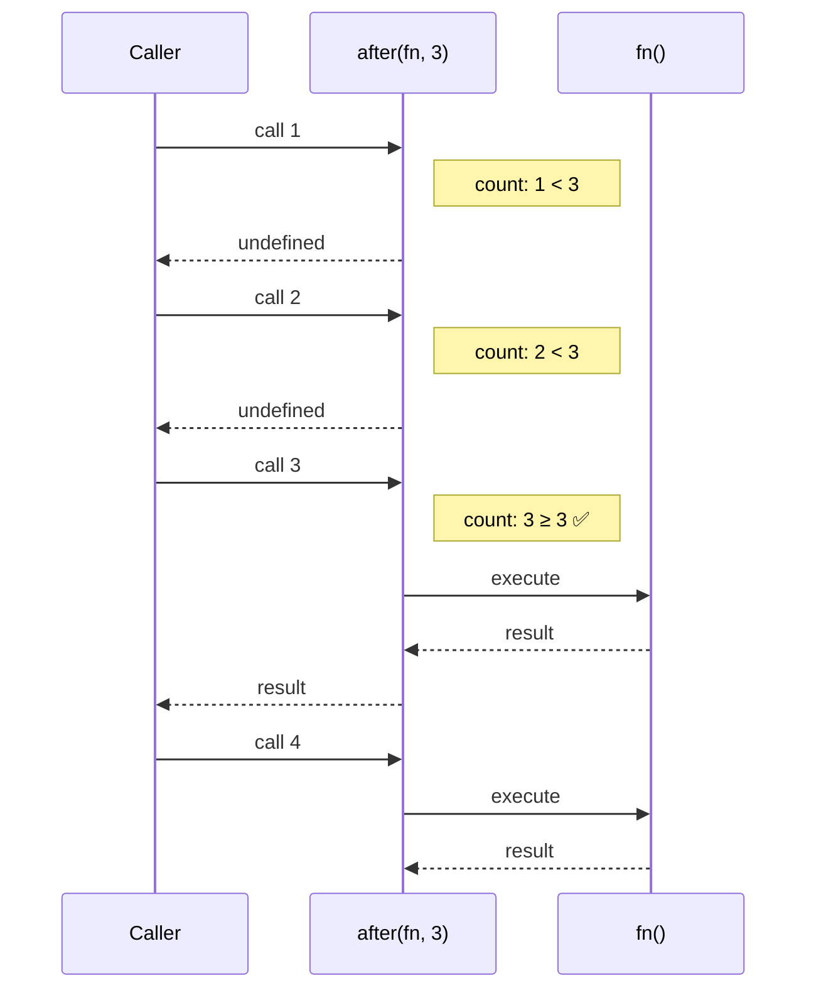
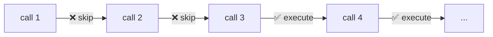

Creates a function that only invokes after being called `n` times.
The first `n-1` calls return `undefined` — starting from call `n`, the function executes normally.

```mermaid
sequenceDiagram
    participant C as Caller
    participant A as after(fn, 3)
    participant F as fn()
    
    C->>A: call 1
    Note right of A: count: 1 < 3
    A-->>C: undefined
    C->>A: call 2
    Note right of A: count: 2 < 3
    A-->>C: undefined
    C->>A: call 3
    Note right of A: count: 3 ≥ 3 ✅
    A->>F: execute
    F-->>A: result
    A-->>C: result
    C->>A: call 4
    A->>F: execute
    F-->>A: result
```

### Visual Timeline

```mermaid
flowchart LR
    A["call 1"] -->|"❌ skip"| B["call 2"]
    B -->|"❌ skip"| C["call 3"]
    C -->|"✅ execute"| D["call 4"]
    D -->|"✅ execute"| E["..."]
```
