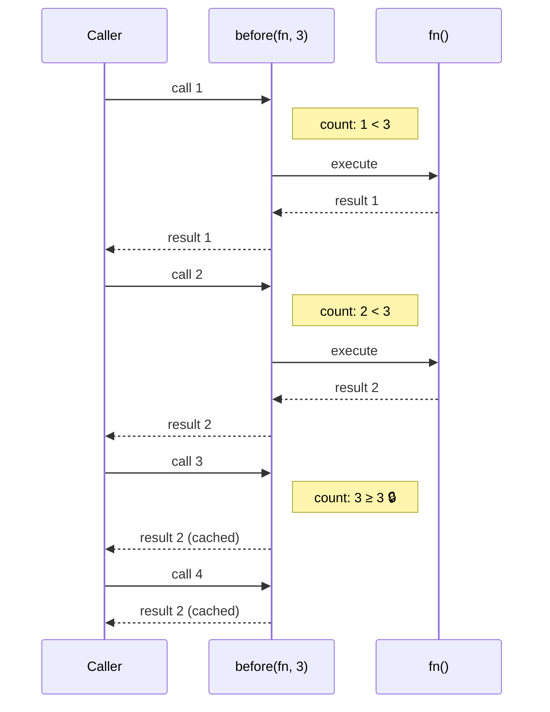

Creates a function that invokes at most `n-1` times.
After `n-1` invocations, subsequent calls return the last result.

### before vs after

| | before(fn, 3) | after(fn, 3) |
|--|---------------|--------------|
| **Call 1** | ✅ executes | ❌ skips |
| **Call 2** | ✅ executes | ❌ skips |
| **Call 3+** | 🔒 cached | ✅ executes |
