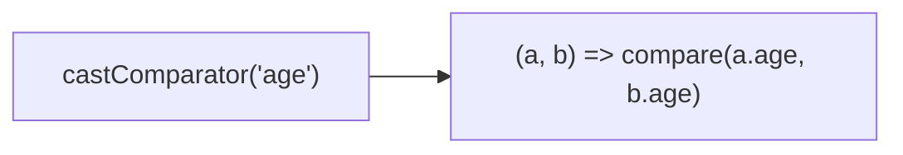
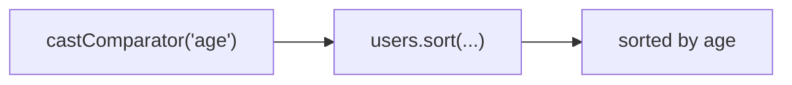
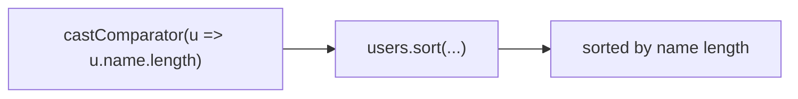
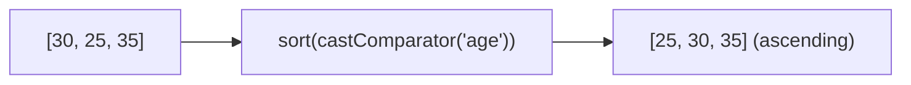
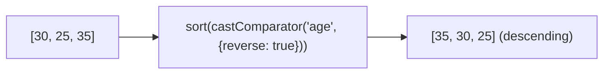

Creates a comparator function for `Array.sort()` from a property key or mapper function.

### Property Key vs Mapper Function

### Options

### Default Comparison

| Type | Comparison |
|------|------------|
| `number` | Numeric subtraction |
| `string` | `localeCompare` |
| `Date` | Timestamp comparison |
| `null`/`undefined` | Sorted last |
