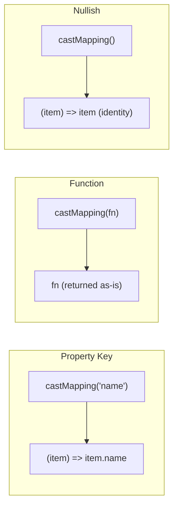
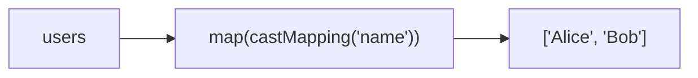

Creates a mapping function from a property key, function, or nullish value.

### Usage Example

### Input Types

| Input | Output Function |
|-------|----------------|
| `'name'` | `(item) => item.name` |
| `(x) => x.id` | `(x) => x.id` |
| `null` / `undefined` | `(item) => item` |
